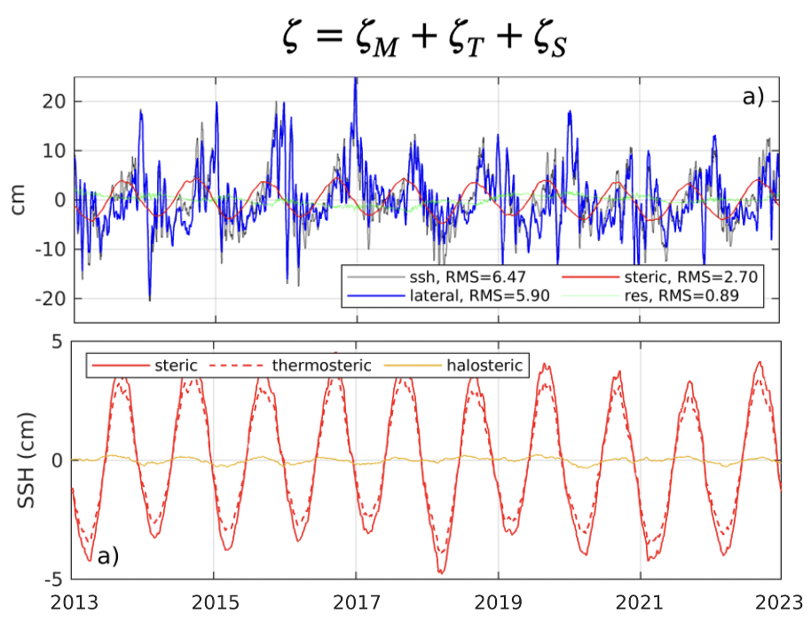
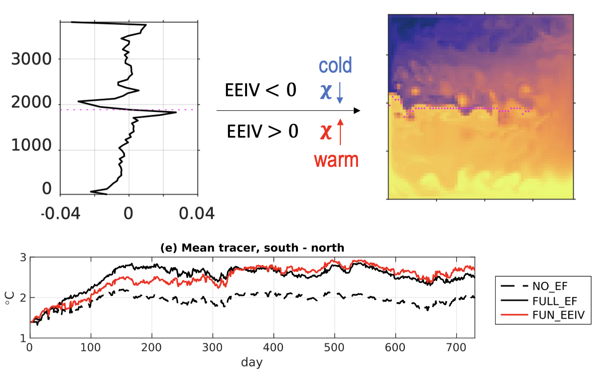

My overall interests are in the ocean large-scale and mesoscale dynamics and their role in climate, using numerical simulations and a variety of advanced analytical methods. I have experience using numerical simulations for studies from dynamics and eddy-induced mixing to regional sea-level variations.

## Sea level change and its drivers

---

## Generalized eddy-induced advection: its role in dispersion and frontogenesis

The eddy-induced advection plays an important role in the generation of filaments and fronts and the enhancement of material dispersion and mixing.

Eddy-induced material dispersion represented by the generalized advection:

Eddy-induced frontogenesis described by the advection:

---

## Estimate Eulerian eddy mixing (rate) from Lagrangian particles

  

    <iframe 
      src="https://player.vimeo.com/video/1113425123?title=0&byline=0&portrait=0"
      style="position:absolute; top:0; left:0; width:100%; height:100%; border:0;"
      allow="autoplay; fullscreen; picture-in-picture"
      allowfullscreen>
    </iframe>
  

---

##  Parameterization of eddy forcing using machine learning 
TBC

---
