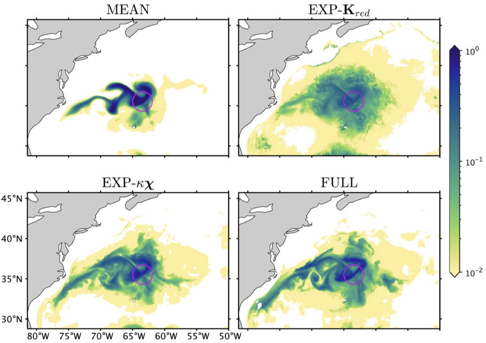

My overall interests are in the ocean large-scale and mesoscale dynamics and their role in climate, using numerical simulations and a variety of advanced analytical methods. I have experience using numerical simulations for studies from dynamics and eddy-induced mixing to regional sea-level variations.

## Sea level change

Preprint can be found at 

---

## Generalized eddy-induced advection

The eddy-induced advection plays an important role in the generation of filaments and fronts and the enhancement of material dispersion and mixing.

 - Eddy-induced material dispersion is effectively represented by the generalized advection ([Lu et al., 2022](https://doi.org/10.1175/JPO-D-22-0108.1)):

- Mesoscale eddies sharpen the large-scale front by advecting (squeezing) tracer contours towards each other ([Lu and Kamenkovich, 2025](https://doi.org/10.1029/2024MS004693)):

---

## Bridging Eulerian eddy diffusivity (mixing rate) and Lagrangian particles

Preprint can be found at [Lu et al. (preprint)](https://doi.org/10.22541/essoar.175611164.43972385/v1).

  

    <iframe 
      src="https://player.vimeo.com/video/1113425123?title=0&byline=0&portrait=0"
      style="position:absolute; top:0; left:0; width:100%; height:100%; border:0;"
      allow="autoplay; fullscreen; picture-in-picture"
      allowfullscreen>
    </iframe>
  

---

##  Parameterization of eddy forcing using machine learning 
TBC

---
